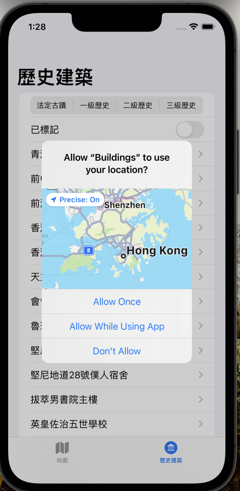
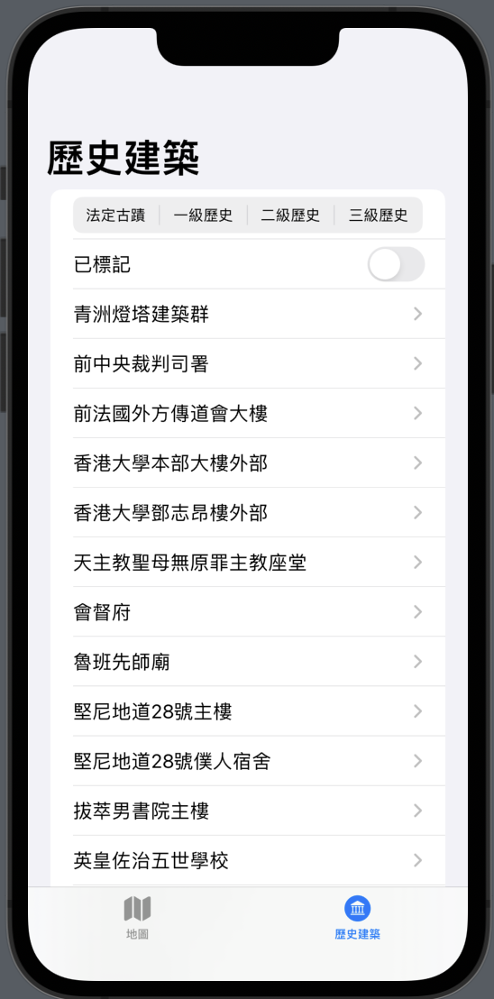
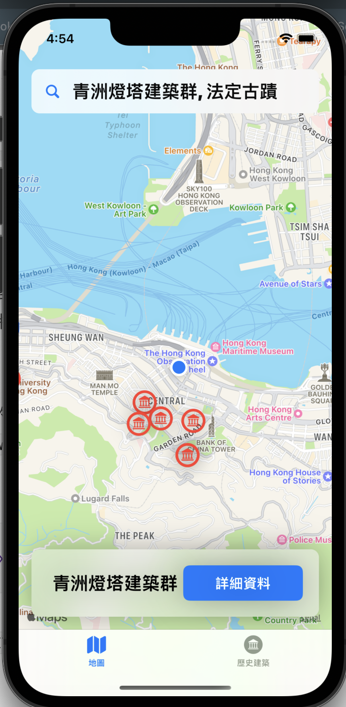
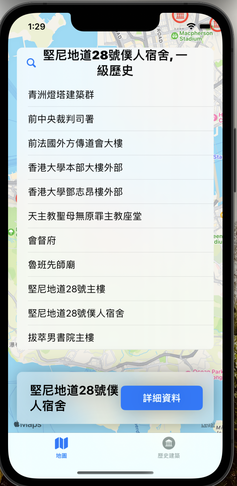
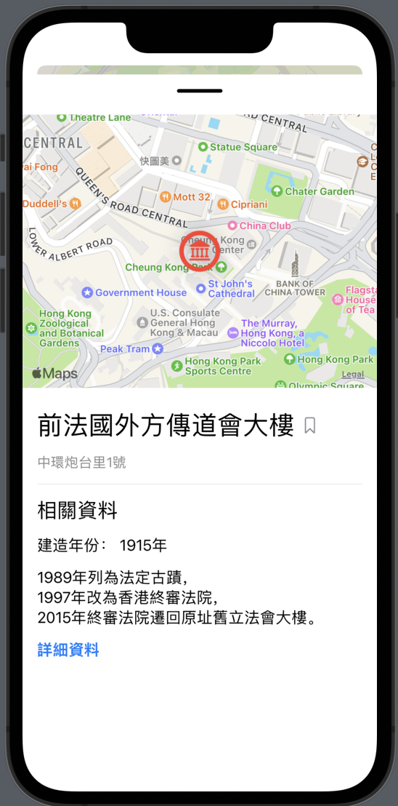

# hk-historic-buildings
An app for discovering historic buildings in Hong Kong

&nbsp;
&nbsp;

Location service authorization (when in use) will be requested from user for the first time. It allows user to easily find out historic buildings nearby.

&nbsp;
&nbsp;

Historic buildings are categorized by gradings and displayed in `List`. Buildings can be filtered by a `Picker`.

&nbsp;
&nbsp;

The detail page showing the address and some other information about the historic building. User can check the bookmark to save it for later use. To have more information, user can tap the "More details" button which links to an external website.

&nbsp;
&nbsp;

`Toggle` is used for filtering bookmarked buildings.

&nbsp;
&nbsp;

Another interface for map-lover is shown by choosing the "Map" tab in `TabView`. It shows locations of all buildings in a `Map`. The logo of chosen location is scaled larger than other.

&nbsp;
&nbsp;

The blue spot represents the user's current location. The map can be zoomed in and out to have more location information.

&nbsp;
&nbsp;

The button with name and magnifier shows the list as well. It is a tool for user to search location quickly.

&nbsp;
&nbsp;

Click "More details" button to show details of the building. The datail page is the same. It is no need to go back to list page and search name again. 

