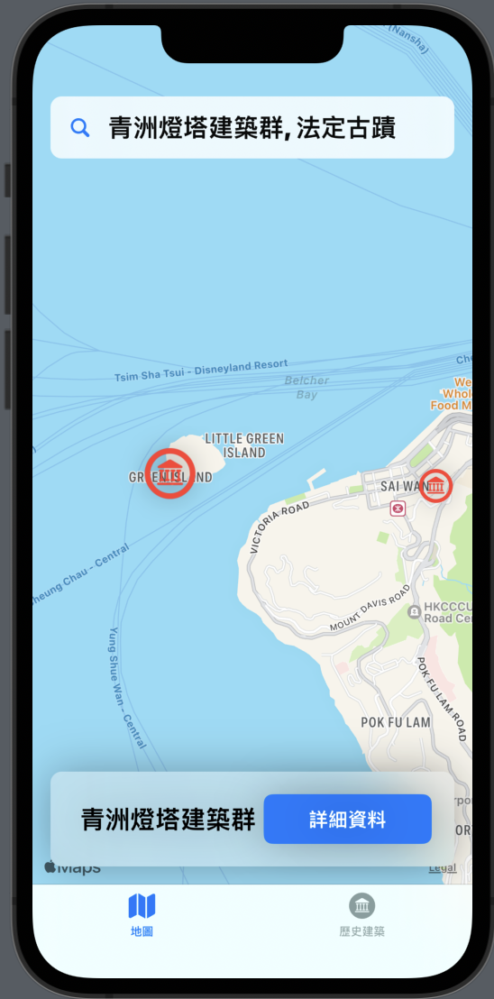

# hk-historic-buildings
An app for discovering historic buildings in Hong Kong

For the first time to open the app, it requests for allowing to use user's location. By offering permission, user can easily find out historic buildings nearby in the map.

A scroll list shows historic buildings classified into different grades.

The first row underneath title contributes to sort buildings by grades. 

Here is the detail page showing the location and some other information about the historic building. User can check the bookmark to save it for later use. To have more information, user can tap the "More detail" button.

It opens a web page when user taps the button. 

The second row computes a filtered version of the list by checking the bookmark.

Another map for map-lover is showed when the tab of map is clicked. It shows locations of all buildings in the list. The logo of chosen location is scaled larger than other.

The blue spot represents the user's current location. The map can be zoomed in and out to have more location information.

The button with name and magnifier shows the list as well. It is a tool for user to search location quickly.

The blue button next to building name navigates to detail page. The datail page is the same. It is no need to go back to list page and search name again. 